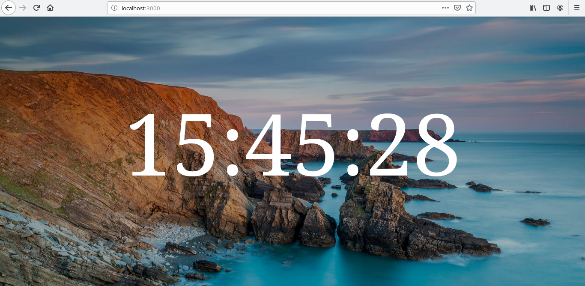
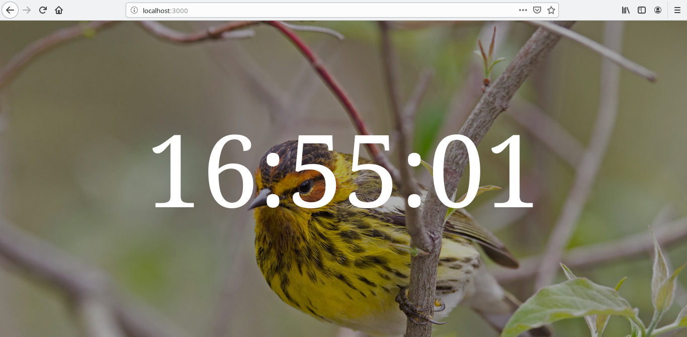

# Clock

A clean and beautiful digital clock.

## Screenshots

The images are downloaded from Bing Wallpapers.





## Dependencies

Use this command to install the dependencies:

```
$ npm install
```

## Usage

### First step

To run the application:

```
$ node app.js
```

### Second step

To see the application, open a browser window and navigate to [http://127.0.0.1:3000](http://127.0.0.1:3000).

## LICENSE

This project is licensed under [MIT License](LICENSE).
